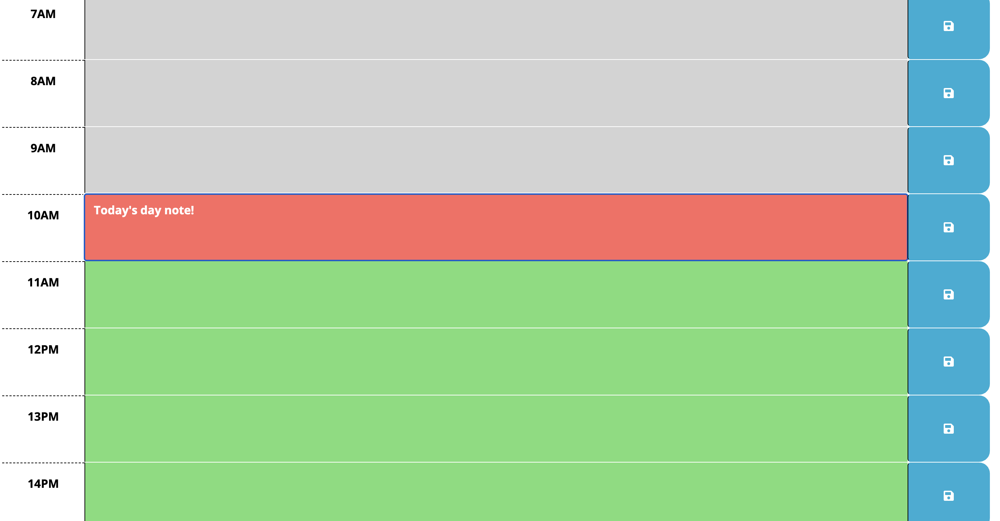

Description

This project is a simple calendar that allows a user to save events for each hour of the day. This app runs in the browser and feature dynamically updated HTML and CSS powered by Jquery.

This app has the following features:

- The date is updated dynamcially.
- Each timeblock is color coded to indicate the user whether it is in the past, present, or future.
- when a user clicks on the time block, then they can enter the event.
- When the page refreshed, the saved events persists.

Links

[URL of the deployed](https://lizas2022.github.io/calendarProject/).

[URL of the GitHub repository.](https://github.com/LizaS2022/calendarProject.git)

Usage

The webpage is optimized and can be viewed on various screens and devices.

